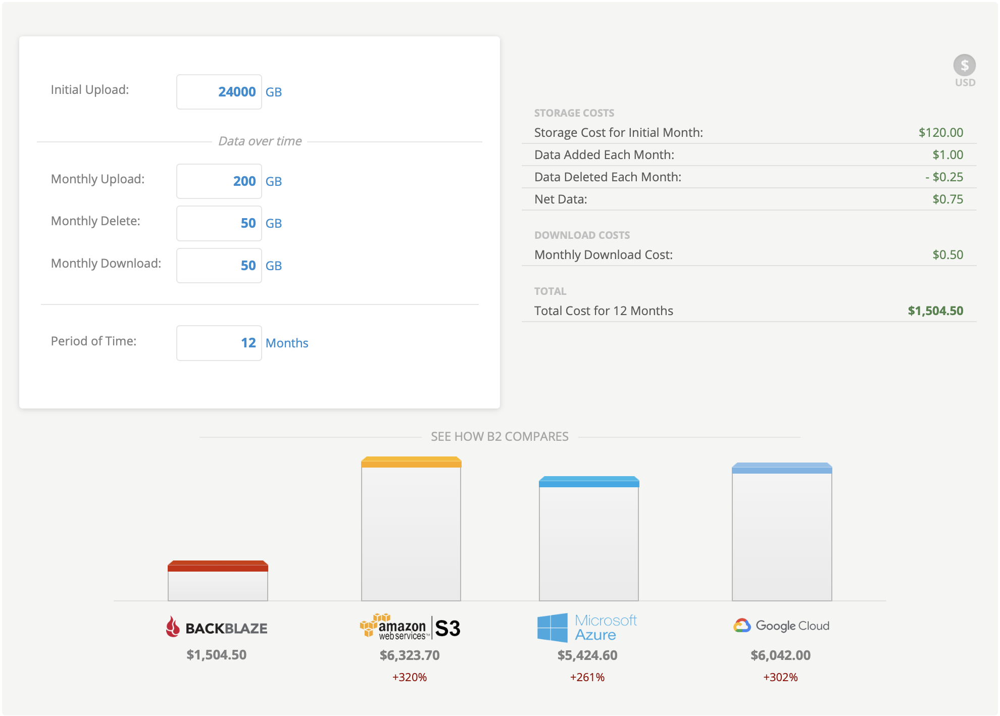
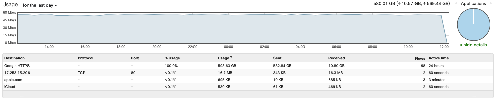

I'm a data hoarder and I have a problem. My local storage infrastructure built on FreeNAS has been rock solid but unfortunately as my local capacity has grown, I had issues scaling an appropriate offsite backup. Today, I'm solving this. 

# Evaluating the Market

The cloud backup market is not short of options, unfortunately for one reason or another many of them fell short of my needs:

## Crashplan

A long time ago, I was using Crashplan's unlimited plan. The price point for unlimited storage was great (~10$ a month) and it had a client that ran on linux  or in a docker container. Unfortunately, that compatibility came from the client being written in Java 😭. This means that the backups were incredibly slow and inefficient. Plus, they shut the service down. 

## Backblaze and B2

Next, I moved to Backblaze, this was an _awesome_ solution for my laptop, but unfortunately I couldn't get it to work for the rest of my servers. Their B2 offering, (similar to Amazon S3, Google Cloud Storage, Azure Storage, etc...) would have worked well on my Linux and BSD based servers, but the cost ruled that out pretty quickly at 20+ TB. 

## Azure, AWS, Google Cloud, etc...

All of these would have been awesome solutions with software like [Duplicati](https://www.duplicati.com) but unfortunately, these enterprise clouds get pretty expensive on a consumer budget. 

_N.B. These prices are for Google, Microsoft and Amazon's hot tier storage, cold tiers like AWS Glacier and the like would have saved some money, but they would still be on the order of Backblaze B2 at over $1000 a year_

So yeah, I'm not spending that much on backups. 

# The Solution

Browsing [r/Homelab](https://reddit.com/r/homelab/) and [r/Datahoarder](https://reddit.com/r/datahoarder/) for a while led me to a potential solution. Google Drive. 

Google Drive by itself doesn't seem like it would help too much, the storage isn't unlimited and it's not designed for mass scale backups like this, but there's a loophole. Some GSuite customers get _unlimited_ Google Drive storage, GSuite for Education customers, and GSuite for Business Unlimited domains with more than 5 users. Lucky for me, my old high school was a GSuite Edu customer and my account is still active. 

Next is to find a backup client that is compatible with Google Drive and can also handle hundreds of thousands of files and not crash. Also, since I'm not the only admin on this GSuite domain and it's cloud storage, I want all the files encrypted before they head up to Google's servers. 

Duplicati as I mentioned earlier seemed like the right solution. When I was still running Unraid as my storage solution, I installed a Duplicati Docker container and got to work. It handled the smaller shares well but when it got to backups that had lots of small files, Duplicati's database model failed to scale well.

I kept looking for other solutions but never found anything free that I liked, then finally, over two years after starting to look at this problem I got a recommendation for ArqBackup from a colleague at Microsoft. Unfortunately it was macOS and Windows only, and had a 50$ license. Thankfully, by the time I got this recommendation I had FreeNAS running ontop of an ESXi Hypervisor so it was pretty easy to create a new virtual machine that I could test this out on. 

_In one day, I backed up over 500GB on a 50Mbps uplink._

I added a 1TB SMB share to Arq to see how it would handle a larger share and it scaled beautifully. Two weeks in, I'm at about 3.2TB of data backed up to Google Drive and it's still going strong. Some test restores I've done have also worked out well. 

The added overhead of a separate VM to run the backups is not ideal, but at the grand total of 50$ one-time to buy Arq, I'm willing to put up with that. I've since added some QOS rules to my Meraki network to low-pri this backup traffic so that more sensitive traffic doesn't suffer from all the bandwidth being occupied. Another important note is that Google caps the daily upload to a Google Drive account to 750GB a day. Fortunately, my internet connection isn't fast enough to do that in a day but if I ever get a better upload speed I can't see myself generating more than 750GB in a given day so I should be fine.

All 23.6TB have been added to the Arq backup, at the current rate, it should take about two months to complete and will continue to add delta backups from then on. As an added benefit, this should also scale well to the remaining 16TB I have waiting for me when I'm back in Montreal.
