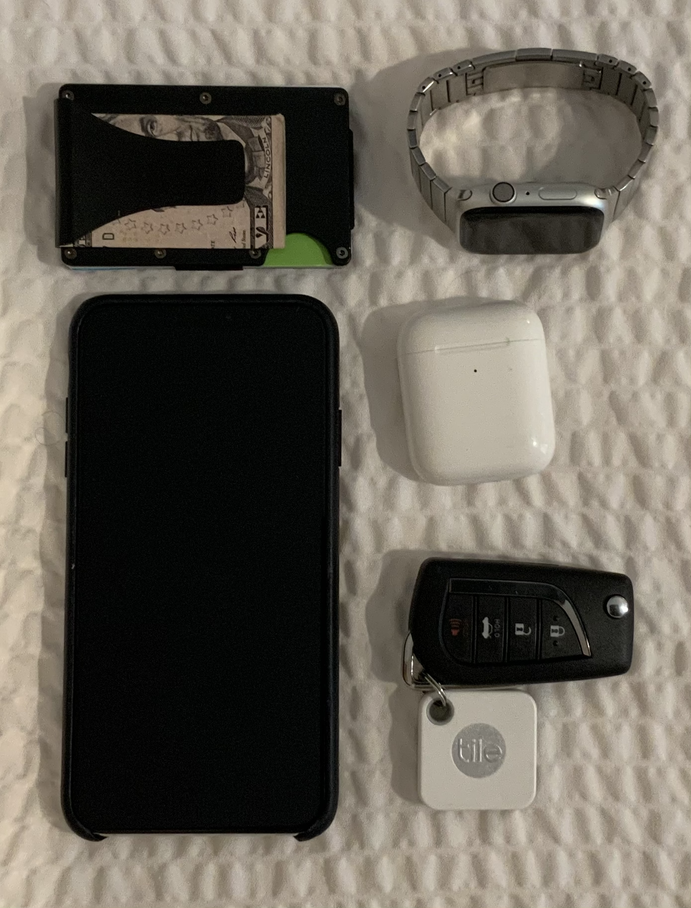

The things I carry every day in my backpack and pockets represents a carefully selected and curative collection of (mostly electronic) items that help me get stuff done on a daily basis. I’ve broken this down into what’s in my backpack which is almost always with my while the contents of my pocket represent the bare minimum of things that I carry at all times.

## Pockets

**[iPhone XS Max:](https://www.apple.com/shop/buy-iphone/iphone-xs)** This should pretty much speak for itself, but I like big phones and like iOS. I use a blue Apple Leather case that has been tastefully worn in since I got it.

**Airpods:** Arguably essential for the modern technology fan, while their sound quality isn’t anything to write home about, the convenience they offer in pairing speed and battery life is second to none. I’m still using first generation AirPods but at some point a few weeks ago I managed to loose the charging case that I then replaced with the new wireless charging case. Drove me nuts but I made it three years without loosing them so I think that’s pretty good. 

**[Apple Watch Series 4 Nike+:](https://www.apple.com/airpods/)** I love my Apple Watch and wear it at all times (even when I sleep!). I’ll charge it while I’m getting dressed in the morning or as I get ready for bed which gives it enough power for the rest of the day and night. I didn’t particularly want the Nike+ model but it was the version that was in stock without cellular when I bought it and there’s not much else of a difference to it. I usually wear a knock-off stainless steel link bracelet I bought on Amazon a few years ago for about 25$. I also have a collection of other knock-offs from Amazon from rubber bands to a Milanese loop. 

**[Wallet:](https://www.amazon.com/gp/product/B074DSWXJZ/ref=ppx_yo_dt_b_asin_title_o02_s00?ie=UTF8&psc=1)** I got a cheap amazon knock-off of the Ridge Wallet. It was less than 20$ and it’s almost perfect. Having a money clip for loose cash and other papers is super handy and it scales seamlessly from my everyday ~5 cards up to 15+ cards without much issue. Looking into finding a way to elegantly add a tile to this setup, stay tuned. 

**Keys:** It’s my keychain, there are as few keys on this as possible since I use an August Lock on my apartment door. There is also a Tile mate on this to track it.

## Backpack

**[Peak Design Everyday Backpack 20L](https://www.peakdesign.com/collections/everyday-bags/products/everyday-backpack?variant=9783969284140):** The latch on this backpack is so satisfying to use, the velcro organizers allow for limitless customizations and it's incredibly comfortable to wear for longer periods of time. If I'm going out with my Camera is also doubles as my camera bag.

**[MacBook Pro 15" Touchbar 2018:](https://www.apple.com/shop/buy-mac/macbook-pro)** My primary computer is almost always on me. It's fairly specced out with the 2.9GHz Core i9 6 Core CPU, 32GB of DDR4 RAM, a Radeon Pro 560X and a 512GB SSD. Plenty of power for everything I need to do from software development to video editing to virtualization. Unlike most others, I don't mind the butterfly keyboard mechanism's feel. I don't strongly enjoy the touchbar but I don't find it offensive either. 

**[iPad Pro 12.9" 3rd Generation:](https://www.apple.com/ipad-pro/)** Complete with 2nd generation Apple Pencil and the keyboard folio, this is a great mobile productivity machines. Even at my desk, I generally prefer to answer emails, edit documents, and generally anything else that works well on iOS. With the keyboard folio and the pencil, I find that working on iOS is more focused and more efficient. There are some things that remain cumbersome on iOS but, iPadOS 13 is making large strides towards narrowing the gap between an iPad Pro and my MacBook Pro.

**[Sony WH-1000XM3:](https://www.amazon.com/Sony-Noise-Cancelling-Headphones-WH1000XM3/dp/B07G4MNFS1/ref=sr_1_1_sspa?crid=1RZKXER5SHNFK&keywords=wh1000xm3&qid=1561747173&s=gateway&sprefix=WH1000%2Caps%2C184&sr=8-1-spons&psc=1)** These headphones are in my opinion the best _sounding_ wireless noise cancelling headphones on the market. USB-C charging is a great bonus to reduct the number of cables I need to carry and have much better treble and bass than the equivalent Bose QC35's. Their only fatal flaw is their inability to connect to more than one bluetooth device at a time. 

**[Logitech MX Master 2S:](https://www.amazon.com/Logitech-Wireless-Cross-Computer-Control-Graphite/dp/B071YZJ1G1/ref=sr_1_3?crid=UET778O01329&keywords=mx+master+2s&qid=1561747200&s=gateway&sprefix=mx+matter+2%2Caps%2C184&sr=8-3)** This is bar none the best day-to-day general purpose mouse on the market. There are better options for gaming but when it comes to productivity this one is unmatched. Countless buttons and gestures, all completely remappable. Supports up to three devices via either unify or bluetooth and has excellent battery life. Unfortunately it still uses USB Micro-B 😡. I also have a [small case for the mouse](https://www.amazon.com/Travel-Logitech-Master-Wireless-hermitshell/dp/B01E5BAYWS/ref=sr_1_2_sspa?crid=UET778O01329&keywords=mx+master+2s&qid=1561747200&s=gateway&sprefix=mx+matter+2%2Caps%2C184&sr=8-2-spons&psc=1) when I want to carry it in my bag, for 10$ it does the job well. 

**[HyperJuice 130W USB-C Battery:](https://www.hypershop.com/collections/battery-pack/products/hyperjuice-130w-27000mah-most-powerful-usb-c-battery-pack?variant=19716546527294)** This was one of the first USB-C battery banks on the market that was able to charge my 15" MacBook Pro at full speed. I backed this on Kickstarter and have been mostly happy with it, but there might be better options on the market now. Having it all based around USB-C has been handy though and I'll simply use my MacBook Pro charger to charge this. 

**Dongle Bag**

* Some Cheap Amazon Bag
* Super USB-C Combo Dongle
* Apple Watch Charger (USB-C)
* Lightning to USB-C Cable
* Lightning to USB-A Cable
* Ethernet Cable
* 3.5mm Audio Cable
* HDMI Cable
* Misc. USB Boot Keys and macOS & Ubuntu Installers

**[Leatheramn Wave+:](https://www.leatherman.com/wave-10.html)** While I don't use this tool every day, I am happy to always have a decent selection of tools on me. The Wave has a good set of pliers in it along with sharp knives, handy scissors, screwdrivers along with files and useful things. 

**[Tile Mate:](https://www.thetileapp.com/en-us/store/tiles/mate?utm_campaign=226381254&utm_source=google&utm_medium=cpc&utm_content=200065419824&utm_term=-&adgroup=43107838253&gclid=CjwKCAjw9dboBRBUEiwA7VrrzdTnD427i0lrk83e4MT-f_kxbrejQfp_knQPhLew9Nz57t88JyoaKBoC5EUQAvD_BwE)** A couple months ago, I had my backpack with iPad, Laptop and many of the other things on this list stolen out of the back of a car. First thought was to check Find My Mac and track the MacBook and iPad but since neither had a cellular connection there wasn't much I can do. A tile hidden in a small pocket of the bag should be a good step towards being able to track this should it get stolen or lost again.

**Other:** Advil, usually spare keys and a granola bar.
